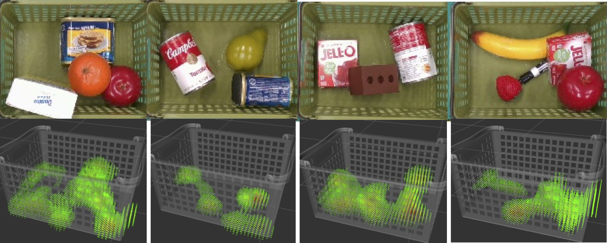
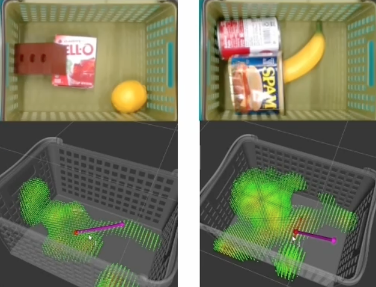
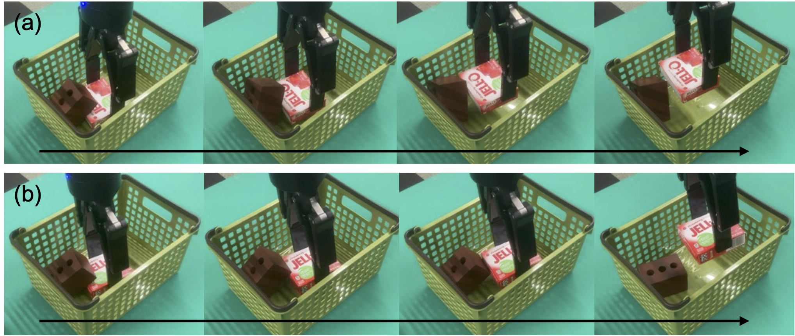

## Abstract

When humans see a scene, they can roughly
imagine the forces applied to objects based on their experience
and use them to handle the objects properly. This
paper considers transferring this “force-visualization” ability to
robots. We hypothesize that a rough force distribution (named
“force map”) can be utilized for object manipulation strategies
even if accurate force estimation is impossible. Based on this
hypothesis, we propose a training method to predict the force
map from vision. To investigate this hypothesis, we generated
scenes where objects were stacked in bulk through simulation
and trained a model to predict the contact force from a single
image. We further applied domain randomization to make the
trained model function on real images. The experimental results
showed that the model trained using only synthetic images
could predict approximate patterns representing the contact
areas of the objects even for real images. Then, we designed a
simple algorithm to plan a lifting direction using the predicted
force distribution. We confirmed that using the predicted force
distribution contributes to finding natural lifting directions for
typical real-world scenes. Furthermore, the evaluation through
simulations showed that the disturbance caused to surrounding
objects was reduced by 26 % (translation displacement) and
by 39 % (angular displacement) for scenes where objects were
overlapping.

## Video

<iframe width="863" height="486" src="https://www.youtube.com/embed/BhEm65I6UIE" title="Force Map: Learning to Predict Contact Force Distribution from Vision" frameborder="0" allow="accelerometer; autoplay; clipboard-write; encrypted-media; gyroscope; picture-in-picture; web-share" allowfullscreen></iframe>

## Predicted Force Maps



## Planned Lifting Directions from the Predicted Force Maps



## Lifting in a Planned Direction



## Citing

```
@article{hanai2023fmap,
  title={Force Map: Learning to Predict Contact Force Distribution from Vision},
  author={Ryo Hanai and Yukiyasu Domae and Ixchel G. Ramirez-Alpizar and Bruno Leme and Tetsuya Ogata},
  journal={arXiv preprint arXiv:2304.05803v1},
  year={2023}
}
```

## Acknowledgements

We would like to thank Natsuki Yamanobe and Abdullah
Mustafa of AIST for their useful discussions. This work
was supported by JST [Moonshot R&D][Grant Number
JPMJMS2031].


